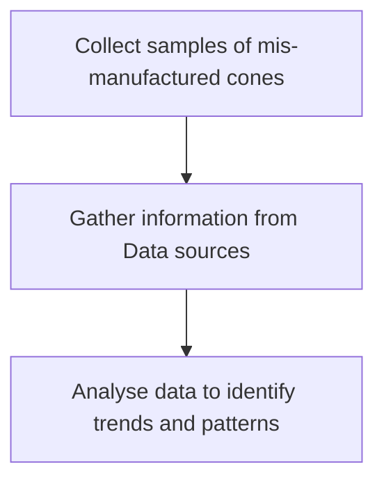
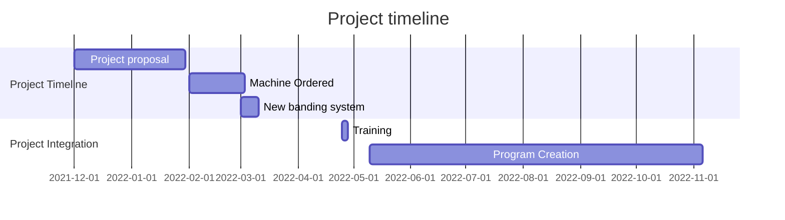
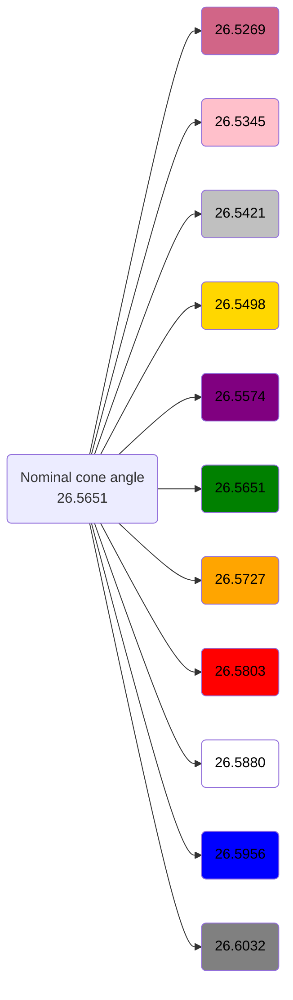
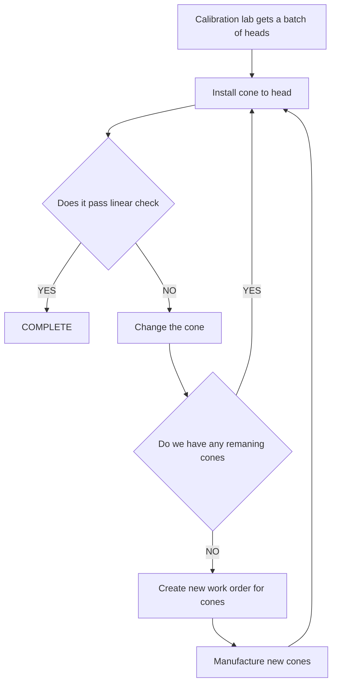

## XT System

<div style="width: 100%;">
  <div style="width: 50%; float: left;"> </div>
  <div style="width: 50%; float: left; padding: 5px 5px 5px 5px;">The Bowers 3 Point Internal Micrometre is a mechanical assembly designed for the accurate measurement of bore diameters, It operates through a 3 points of contact in an expanding mechanism driven by a linear plunger the translation of movement is produced through a precisely angled cone meshing against contact points to the fixed measuring anvil (herein; anvil).  (K6) (Fig1; Cross section technical drawing)
</div>
</div>
---

The angle of the cone determines a linear ratio between the distance travelled in the downwards plunging direction vs the expansion of the clamps, This ratio is controlled and determined by a precision ground angle what must be a controlled processes. The angle of the cone is a ratio this can then be used to take up variance in other parts of the assembly (Plunger with linear scale/lead screw/analogue scale) Therefore it is prudent to have a series of manufactured and measured cones within a variance in the angle created as to allow for linearity factor adjustment, These then can be categorised by a colour banding system (B4)

Due to the banding system in place a requirement arose for a machine capable of measuring the cones with precision due to the fact that our current banding system has a drift as there is no deterministic measurement meaning that cones are just made to machine parameters and not an actual measurement. Meaning we have a non feedback looped system with no actual determinising measurement such that we are at the whim of the machine settings and tolerances with no feedback.


### Root Cause Analysis for Mis-Manufacturing of Bowers XT Cone

```ad-warning
title: Problem Statement
The Bowers XT Cone is being mis-manufactured, resulting in incorrect dimensions and suboptimal performance of the Bowers 3 Point Internal Micrometer. This root cause analysis aims to identify the underlying causes of this problem and suggest corrective actions to address the issue.



### Fishbone Diagram
!()[https://i.imgur.com/LOVtESK.png]

### Corrective Actions
-  Implement targeted training for operators to address identified skill gaps and reinforce adherence to standard operating procedures.
- Ensure that equipment is properly calibrated, maintained, and updated according to manufacturer recommendations
-  Establish or improve quality control measures, including incoming raw material inspection and in-process inspection, to ensure material consistency and detect issues early.

During the scope of this report we will be looking at a reliable in process inspection procedure what allows us to accurately determine the angle of the XT cone by means of measuring with a calibrated instrument. This will require capital investment to purchase equipment for the project and furthermore should rectify the manufacturing issues 

The best suited piece of equipment for this would be the Sylvac scan machine. This is a laser based measurement system what allows us to accurately determine the angle and various diameters using laser displacement measurements. 
(S3) (K1)
![[Pasted image 20230328101856.png]]


(Fig2; Animated X-ray view of a Bowers XT 50-65 Measuring head, Animated by myself using Autodesk Invetor(K14))


### Project management 

(S3)(K12)




The inclusive angle banding was selected to give a large travel range to support the possible tolerance buildup throughout the head assembly inline with the manufacturing tolerances applicable. This solves the problem of avoiding the mis manufacturing as we can have a distribution in the manufactured tolerance and then fit that to the curve of what is best for the specific batch of heads. (K9)
The above is an example for one size, the nominal cone angle changes for each size slightly 

### Determining the angle using the Scan Machine

Initially cones were measured on the Sylvac S25 Scan machine to see where the current manufactured angle. This was done in collaboration with a colleague N. Sharp (B6)(B7). Using the engineering drawings for the currently manufactured drawings the measurement sequence was created (S1)
Conforming to ISO9001 means that data must be measured and processed to make informed decisions on how to best act with regards to the cone system being created therefore use of key quality control principles are applied (The scientific method/evidence based decision making).  (K7)


(Fig3: An example from the Sylvac scan machine showing a cone being measured)

The Sylvac scan machine measures its dimensions using a precision laser displacement sensor in a temperature controlled grinding room, It is a non contact measurement (Subsequently non-destructive) to determine an engineering measurement (K20)

Finished and measured cones are stored in a Kanban System(Lean tool system) storage system organised by shelf level for each size and then each colour determining the angle range for a specific size, Furthermore the flipside of the labels contain a X to show they are no longer in stock, (Image below) (S7) (S8)


### SOP for measuring 
When measuring a cone in the scan machine it is critical the the operator follows the SOP for the measuring system, This means that we can get a deterministic repeatable measurement. Furthermore failure to adhere to the standard operating procedure could result in 
- Damage to expensive equipment
- Operator injury or death
- Failure to manufacture a quality product
- Not complying with the relevant ISO standard either in manufacturing (ISO 9001) or quality control
- Failure to deliver products in a due manner from the above reasons.

(K10)

### Manufacturing savings 
Although the exact figures cannot be determined due to early scope of the project and limitation of data we can 
collect. It is fair to say that a reasonable cost saving has been made due to the elimination of the cyclical nature of testing the cones once they have been manufactured. This saves both man hours and machine time as the graph below shows the previous system and the calibration lab have reported a lower rejection rate for heads and much easier time doing their job meaning overall we have reached a successful endpoint.



### Cost control measures by eliminating non-used cones
After the collection of data for the sizes of cones used in calibration, it has been determined that some grades are not used meaning there is a cost control measure being applied that they do not need to be (wastefully) manufactured. 
![[image003.png]]
From the data above we can see that for some sizes we have 0 requirement for usage meaning that we can save out on even creating them in the first place. Although there is not much historical data for the prior unused cones as they were thrown out the SPC in SAP for cones is between ~£4.52 to £16.23 each so the cost savings are dramatic.
(Data was accessed through company ERP system SAP)
```vbscript
'Formula for counting cones
=INT(COUNTIFS("Cone Use Record"!$I$2:$I$999981,$B7,"Cone Use Record"!$F$2:$F$999981,"BLUE"))/MNTHS
'Formula for months since data collection started
=VALUE(DATEDIF("15/08/2022",EDATE(TODAY(),0),"m"))
```
(S9)(K21)
